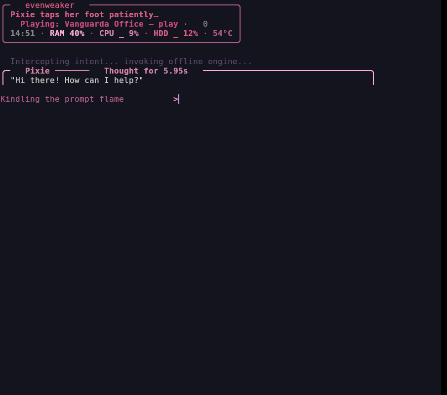
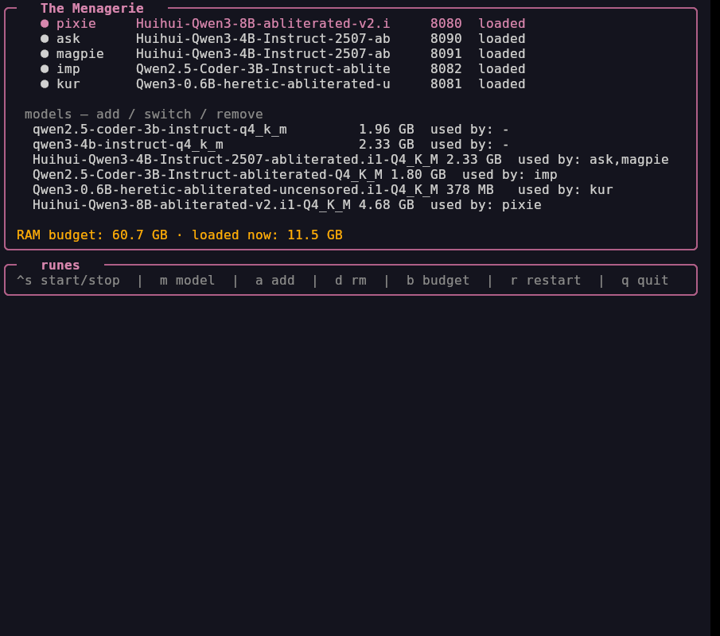
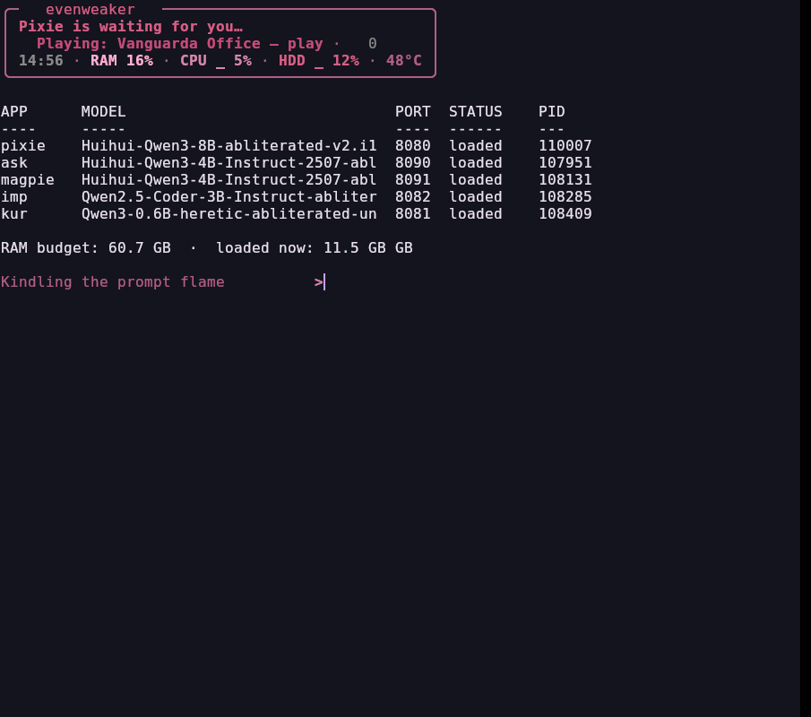

# Pixie — local AI agent stack

Offline-first local agent: **pixie** (files + tools), **ask** (one-shot agent), **imp** (code helper), **menagerie** (model/app control plane + `llama-server` spawner). No cloud, no telemetry. Each app owns its own `llama-server` on its own port.

Source-only kit — scripts + configs. Models (`*.gguf`) and libs (`llama-server` + `.so`) live on the machine, never in git.

## Look





```
   *   
  \|/  
   |   
---*---
   |   
  /|\  
   *   
```

## Apps + ports

| App | Port | Default model |
|-----|------|---------------|
| pixie | 8080 | qwen3-4b |
| ask | 8090 | qwen3-4b |
| magpie (external) | 8091 | qwen3-4b |
| imp | 8082 | qwen-coder first |
| kur (external) | 8081 | smollm2-360m |

Switch: `menagerie set <app> <model>`. Add: `menagerie models add`. Budget: `menagerie budget`.

## Install

```bash
git clone git@github.com:ElegantVW/pixie.git ~/pixie
cd ~/pixie && ./install.sh
# models → ~/.local/share/pixie/models/*.gguf
# libs   → ~/.local/lib/pixie/llama-server
# bins   → ~/bin/pixie ~/bin/ask ~/bin/imp ~/bin/menagerie ...
```

Then: `menagerie status all` and `pixie "hello"`.

## Layout

| Path | Role |
|------|------|
| `bin/pixie` | TUI + one-shot + tool dispatch |
| `bin/pixie_mind.py` | memory/sessions/plans/spells (no LLM needed) |
| `bin/pixie-session` / `pixie-screen` | reply log / tick hold policy |
| `bin/menagerie*` | control plane, registry, runner, TUI |
| `bin/imp` / `bin/ask` | code helper / offline agent |
| `bin/fae_termart.py` | pink frame renderer (vendored) |
| `shell/pixie.zsh` | PATH/palette/tick/grace hooks |
| `config/pixie/spells.toml` | 15 spells |
| `docs/` | pixie / menagerie / imp plans |

## Voice

Cute after competence. Errors: `<app>: <one sentence>` + `next: <one thing>`, `detail:` only with `FAE_DEBUG=1`.

## What never goes in git

`*.gguf`, `*.so*`, `llama-server` binaries, `~/.cache/pixie/sessions/*.jsonl`, `memory.md`, `menagerie.json`, credentials, passwords, client PII.

## License

MIT — see [LICENSE](LICENSE).
